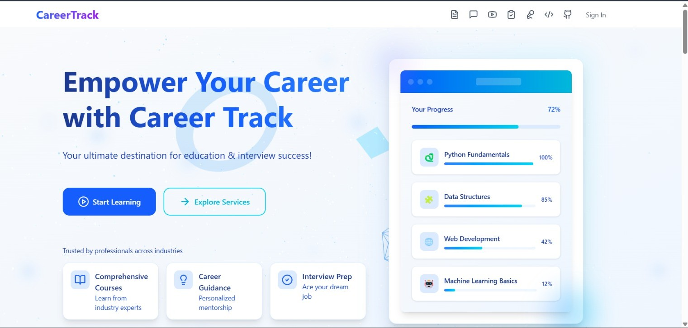

# CareerTrack - The Smartest Way to Learn, Prepare & Succeed! 🎓

🔗 **Live Website:** [CareerTrack](https://careertrack-one.vercel.app/)  
📱 **App:** Available for Android & iOS 
 
 
  

## 🎯 Problem Statement
### The Challenges Faced by Students & Job Seekers

1. **Rising Job Market Competition** 🚀  
   - The technology job market is rapidly evolving, and students often struggle to understand **which skills are in demand**.
   - Freshers face difficulties in **landing their first job** due to a lack of **interview preparation, strong resumes, and project portfolios**.
   - Many students fail **ATS (Applicant Tracking System) screenings** due to poor resume optimization.

2. **Fragmented Learning & Career Preparation Resources** 📚  
   - Students need to access multiple platforms for learning (YouTube, GitHub, PDFs, quizzes, etc.), making the process **time-consuming and inefficient**.
   - Understanding **GitHub repositories and research papers** is difficult without proper guidance.

3. **Lack of Career Guidance & Personalized Roadmaps** 🛣  
   - Many students don't know **which technologies to focus on** or how to build a structured career roadmap.
   - There is no **personalized AI-driven mentorship** to guide students based on **job market trends**.

4. **Mental Health & Productivity Struggles** 🧠  
   - Students and early professionals often face **burnout, stress, and anxiety** while juggling academics and job preparation.
   - There is **no integrated solution** that tracks **study time, breaks, and overall mental health**.

### **How CareerTrack Solves These Problems**
CareerTrack is an **AI-powered career companion** that integrates **learning, job preparation, productivity tracking, and mental well-being support** into a single, seamless platform. It stands out as a crucial solution in today's competitive job market and education landscape due to the following:

1. **End-to-End Career & Learning Support**: Unlike traditional platforms that focus on a single aspect (e.g., resume building or job searching), CareerTrack provides a **comprehensive ecosystem** for career success.
2. **AI-Driven Personalization**: Every feature adapts to the user's profile, ensuring **tailored career roadmaps, job recommendations, and learning resources**.
3. **Seamless Integration of Web & Mobile**: Users can **track their progress in real time**, ensuring they stay productive while maintaining a **healthy work-life balance**.
4. **Holistic Career Growth**: It bridges the gap between **learning, practical skill-building, and career planning**, making students job-ready from day one.
5. **Mental Well-Being & Productivity Focus**: The platform ensures students and professionals can avoid burnout, a crucial factor in long-term success.

## 🌟 Key Features

### 1️⃣ **Tech Job Market Insights** 📈
- Explore **future job trends and growth projections** across different technology domains (2024-2028).
- Get **AI-powered career recommendations** based on industry demand.

### 2️⃣ **Placement Services** 💼
- **ATS Resume Generator**: Create resumes optimized for ATS systems to pass screening algorithms.
- **AI Resume Builder**: Generate and download a **professional resume as a PDF** with minimal inputs.
- **Mock Interview Prep**: AI-powered interview simulation with real-time feedback.
- **Code Portfolio**: Showcase your coding projects with an **AI-curated portfolio** that highlights strengths.

### 3️⃣ **Educational Services** 📚
- **Chat with PDF**: AI-powered interaction with **research papers, notes, and study materials**.
- **YouTube Video Summarizer**: AI-generated concise summaries of YouTube videos for quick learning.
- **Quiz Generator**: Instantly create custom quizzes on any topic for better retention.
- **Chat with GitHub**: AI-powered **explanation of repository structures and code**.

### 4️⃣ **Productivity & Mental Health Tracking** 🧘‍♂️
- **Pomodoro Timer**: Improve focus with time management techniques.
- **Health Tracking**: Track sleep, heart rate, and stress levels.
- **Breathing Exercises**: Reduce stress with guided exercises.
- **To-Do List & Study Tracker**: Organize study schedules and monitor progress.

### 5️⃣ **Sync Dashboard (Web + App)** 📊
- **Real-time sync between web and mobile app**.
- **Track sleep, study hours, breaks, and to-do lists**.

## 🛠 Tech Stack

### 🚀 **Frontend:**
- **Next.js (React Framework)**: Modern, fast, and scalable web application.
- **TypeScript**: Ensuring type safety and maintainability.
- **Tailwind CSS**: Custom UI components for a clean user experience.

### ⚙️ **Backend:**
- **FastAPI**: High-performance Python framework for AI-powered backend logic.
- **Supabase**: Secure, scalable, and open-source database solution.
- **Clerk**: Secure authentication system for user management.

### 🤖 **AI & Machine Learning:**
- **Generative AI (Langchain)**: Powering resume scoring, chatbots, and summarization features for personalized recommendations.
- **Intelligent Mock Interviews**: AI-driven speech and sentiment analysis for real-time feedback
- **TensorFlow & Deep Learning**: Advanced human detection & liveliness verification in AI-driven interview simulations.

### ☁️ **Hosting & Deployment:**
- **Vercel** (Frontend Deployment).
- **Render** (AI Model Hosting).

## 🔥 Novelty & Innovation
### What Makes CareerTrack Unique? 🏆
1. **All-in-One Career Assistant** 🎯
   - Combines **learning, job preparation, productivity tracking, and mental health features**.
   - Eliminates the need for multiple tools, saving time and effort.

2. **AI-Powered Resume & Interview Support** 🤖
   - **ATS Resume Optimization** increases the chances of passing automated screenings.
   - AI-driven **mock interviews** provide real-time feedback on job readiness.

3. **Smart Learning with AI** 📚
   - AI-powered **Chat with PDF, GitHub Repositories, and YouTube Summarization**.
   - Quiz Generator to **test and reinforce learning**.

4. **Mental Health & Productivity Tracking** 🧘
   - First-of-its-kind **integrated mental wellness tracker**.
   - AI-assisted **study tracking, sleep monitoring, and stress management**.

## 🤝 Contributors
👤 **K.Hariprasaadh** - [GitHub](https://github.com/Hariprasaadh) | [LinkedIn](https://www.linkedin.com/in/hariprasaadh-k-a5430a287/)  
👤 **Mithil Girish** - [GitHub](https://github.com/mithilgirish) | [LinkedIn](https://www.linkedin.com/in/mithilgirish/)  
👤 **V.Prasanth** - [GitHub](https://github.com/prashhviji) | [LinkedIn](https://www.linkedin.com/in/prasanth-v7115/)  
👤 **Venkatakrishnan** - [GitHub](https://github.com/venkat24k) | [LinkedIn](https://www.linkedin.com/in/venkata-krishnan-4618b9292/)  

## 🌟 Support & Feedback
If you like this project, ⭐ **star this repo** and share your feedback! 📝

